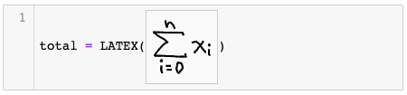
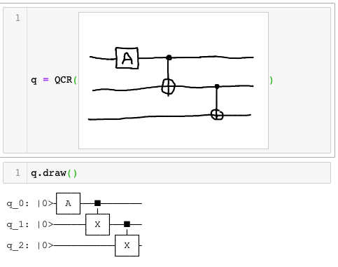
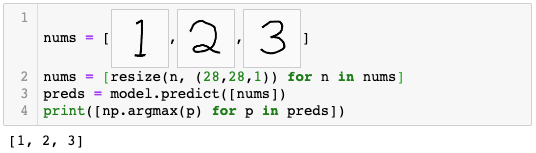

# Notate (Jupyter Notebook Extension)
### 1. Tear open HTML canvases and draw on them.
Use Ctrl+\ (Backslash) to inject a canvas at the cursor position in the selected cell. Draw on it:

### 2. Canvases are auto-passed to Python as 2d NumPy arrays (images) upon run.
In-line, canvases act as variable names. On running the cell, silently injected code sets the variables equal to NumPy image data. (This performs a number of imports: base64, numpy as np, io.BytesIO, and PIL.Image. If you pass the image as a single argument to a function (e.g. foo(*canvas*)) it will also pass the locals() dict as an added '.locals' attribute of the nparray object.)
### 3. Do what you want with the output.
Pass handwritten digits to an MNIST recognizer for all I care! Here's an example of a magical QCR function recognizing a handwritten quantum circuit (function not included):

And here's an obligatory MNIST example (see examples/ folder for more):

### Extra features
- You can copy+paste canvases like you would text.
- Drag sides of canvas to resize. (Pixel-perfect resize is not yet available.)
- Click on a canvas to enter full-screen view. Right now, it only supports a black pen, an eraser, and a 'clear canvas' function. Click off the full-screen view to minimize.

## Install guide
1. [Install Jupyter Notebook Extensions.](https://jupyter-contrib-nbextensions.readthedocs.io/en/latest/)
2. Find the nbextensions folder. On Mac, it's in /Users/*yourusername*/Library/Jupyter.
3. Place the notate-jupyter folder inside.
4. If you had Jupyter Notebook open, restart it. On the Jupyter Home page, click the Nbextensions tab. Click 'Notate' to enable.

### Required libraries
- PIL/[Pillow](https://pillow.readthedocs.io/en/stable/installation.html) (so "from PIL import Image" works)
- [NumPy](https://numpy.org/install/)

Relatedly, ensure your namespace doesn't use names Image, BytesIO, or base64 except where imported from the PIL, io, and base64 libraries. Note that I cannot guarantee compatibility with other extensions.

##### Mileage may vary. Tested on Google Chrome v91.0 with MacOS.
